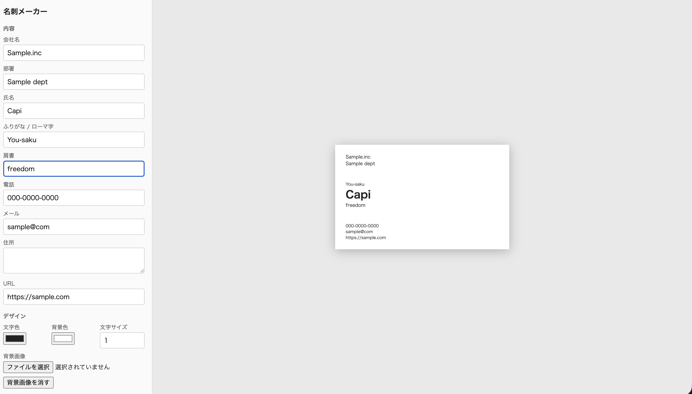

# card-maker — 自分で名刺を作れる

設定 → 名刺の描画 → 印刷 (または入稿用 PDF) までブラウザだけで完結する名刺メーカー。
依存ゼロ、`index.html` 1 ファイル。ダブルクリックで開くだけ。



## 使い方

1. `index.html` を開く
2. 左のフォームに内容を入れる。右に実寸プレビューが即時反映される
3. デザインは文字色・背景色・文字サイズ・背景画像 (ローカルの画像ファイル)
4. 印刷は 2 通り
   - **A4 名刺用紙に面付けして印刷** — 91×55mm なら 2×5 の 10 面。市販の名刺用紙 (A4 10 面) に合う
   - **入稿用 PDF を保存** — 塗り足し 3mm 込み (97×61mm) の 1 ページ。ブラウザの印刷ダイアログで「PDF に保存」して印刷会社に入稿する

入力は `localStorage` に自動保存され、次に開いたとき復元される。

## 構成

`index.html` の `<script>` は 4 層に分かれている。class を使わず「値と関数」で組む。

```
domain   純粋。DOM に触らない。validateSpec (生値 → 検証済み spec) / sheetGrid (A4 面付け) / bleedPage (入稿ページサイズ)
app      ワークフロー。ports (関数のレコード) を高階関数で受け取る。updateSpec / printCard / pickImage
infra    ports の実装。localStorage / window.print / FileReader。副作用はここだけ
ui       フォームの生値を集める → app → 描画。cardHTML がプレビュー・面付け・入稿の 3 箇所で共通
```

エラーは値。`validateSpec` は `{ ok, value } | { ok, error }` を返し、`error.kind` (`InvalidSize` など) を ui の `errorMessage` が一箇所で文言に変換する。

将来 TypeScript + React に移す前提の区切り方 (参考: [fp-layered-hono-demo](https://github.com/You-saku/fp-layered-hono-demo))。
各層をそのまま `src/domain` `src/app` `src/infra` `src/ui` に切り出し、`Result` ヘルパーを neverthrow に置き換える。

## 自己チェック

domain は純粋なので、ページ読み込み時に `console.assert` で検証している (91×55 → 2×5 面、幅 0 → `InvalidSize` など)。
ブラウザの Console にアサート失敗が出ていなければ OK。

## 割り切り

- 表面のみ。裏面・複数テンプレート・要素のドラッグ配置はまだない
- 入稿 PDF は RGB でトンボなし。ラクスル等はこれで受け付ける
- 背景画像込みで `localStorage` の約 5MB が上限。超えたら IndexedDB に替える
